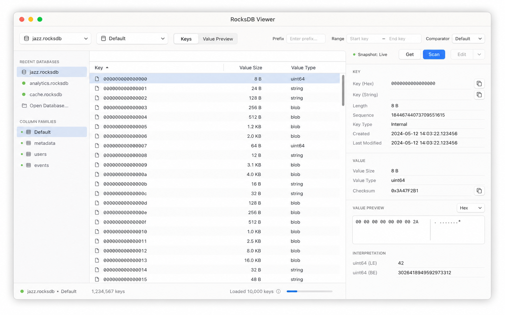
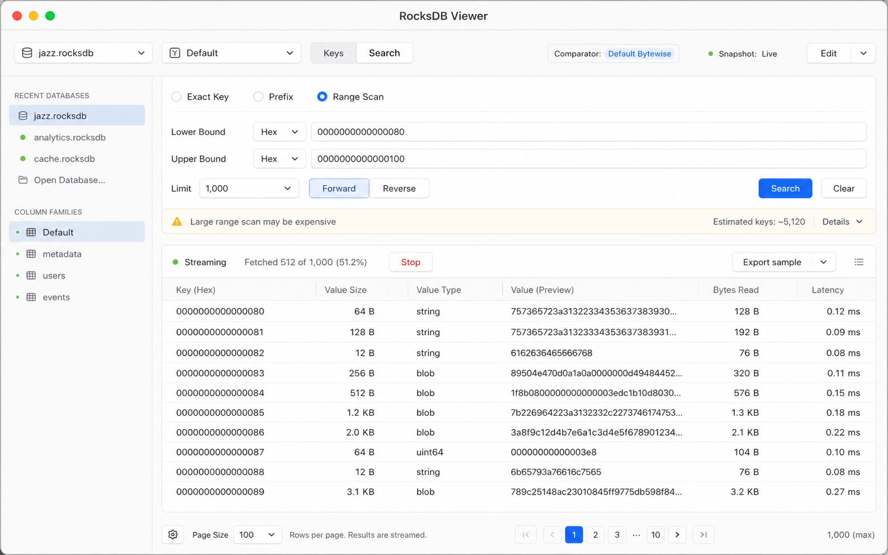
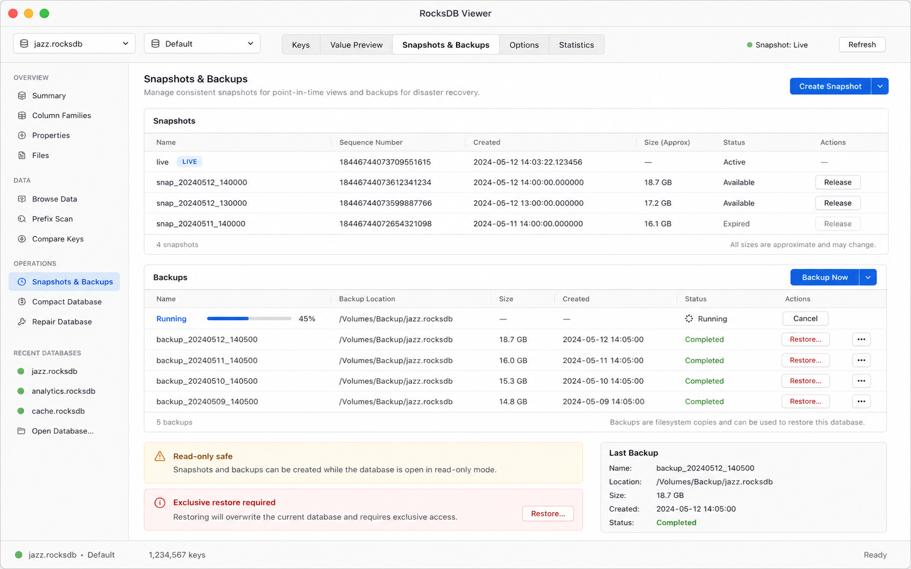
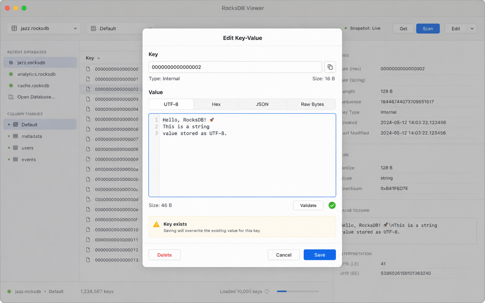
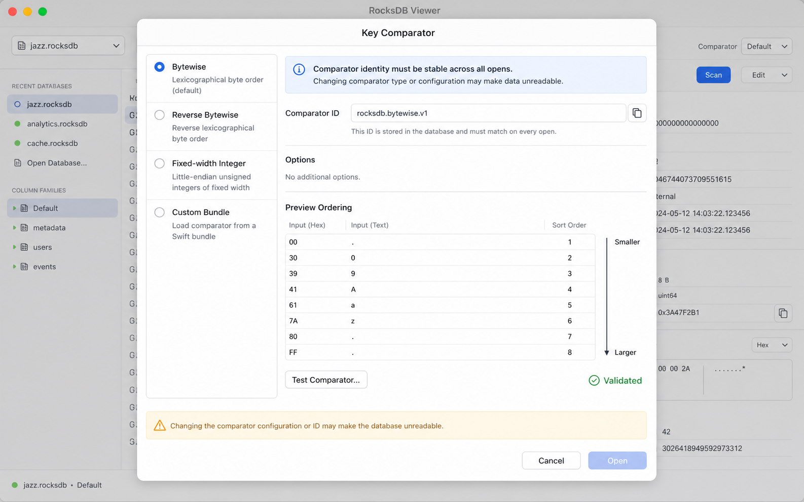
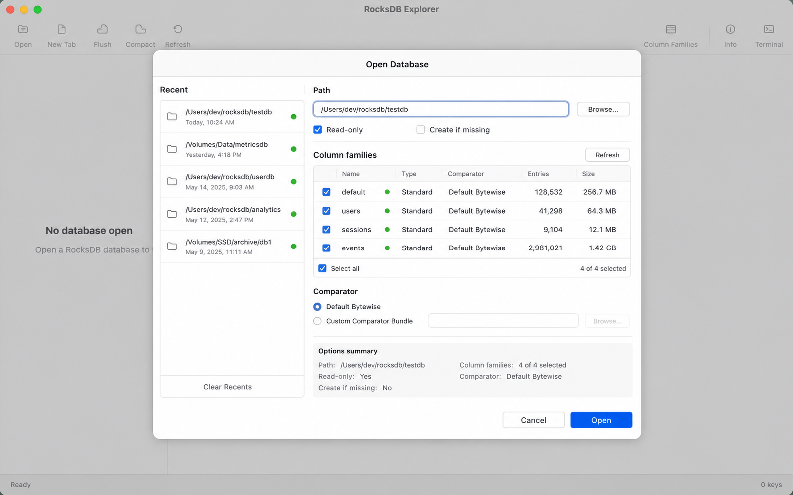

# RocksDB Viewer for macOS - Product and Engineering Spec

## 1. Goal

Build a native Swift macOS application for inspecting and editing RocksDB key-value data with a minimal memory footprint.

The app is a focused database utility, not a general IDE. It should make the common RocksDB workflows fast and safe:

- Open an existing RocksDB directory.
- Reopen recently visited databases from local history.
- Browse keys and values without loading the database into memory.
- Search exact keys, prefix ranges, bounded ranges, and reverse ranges efficiently.
- Configure custom key comparators before opening a database.
- Add, edit, and delete keys and values.
- Create and release snapshots for consistent reads.
- Create backups and restore from backups with explicit safety controls.

The core product promise is: show key-value data quickly, stream results incrementally, and keep memory bounded even on very large databases.

## 2. Non-Goals

- No SQL layer.
- No full-text indexing layer.
- No automatic database compaction UI in the first release.
- No remote database daemon or server mode.
- No attempt to infer arbitrary custom comparator semantics from an existing DB automatically.
- No loading all keys, values, column families, or metadata into Swift arrays for display.
- No web app, Electron app, or cross-platform UI framework.

## 3. Platform and Technology

The app must be a native Swift macOS app.

Required stack:

- macOS target: macOS 14 minimum, macOS 15 optimized.
- UI: SwiftUI for primary layout.
- AppKit interop: allowed for file panels, table virtualization gaps, responder-chain behaviors, and window management.
- RocksDB access: C++ RocksDB library bridged through a narrow Objective-C++ or C-compatible wrapper.
- Concurrency: Swift structured concurrency with explicit cancellation.
- Persistence: local app state stored in `Application Support`, using `Codable` JSON or SQLite if history grows beyond simple needs.

Memory requirements drive the architecture:

- Swift UI state stores only visible rows, small scan buffers, recent DB metadata, selected row metadata, and active operation state.
- RocksDB iterators stream key-value pairs into bounded batches.
- Value previews use size limits and lazy loading.
- Large values are never copied repeatedly between C++ and Swift.

## 4. Users

Primary users:

- Engineers debugging RocksDB-backed applications.
- Developers validating key encodings and migrations.
- Operators who need safe backup, restore, and spot edits on local databases.

User assumptions:

- Users understand keys and values may be binary.
- Users understand comparator mismatch can make a RocksDB database unreadable or incorrectly ordered.
- Users need guardrails for destructive operations, not simplified abstractions that hide risk.

## 5. Scope

### 5.1 MVP

The first complete release includes:

- Open database flow with recent history.
- Read-only and read-write open modes.
- Column family discovery and selection.
- Built-in comparators:
  - Bytewise.
  - Reverse bytewise.
  - Fixed-width signed integer.
  - Fixed-width unsigned integer.
  - UTF-8 lexical.
- Custom comparator bundle loading.
- Key-value browser table.
- Exact key lookup.
- Prefix scan.
- Bounded range scan.
- Reverse scan.
- Add key-value.
- Edit key and value.
- Delete key.
- Snapshot creation and release.
- Backup creation.
- Restore backup to a chosen destination.
- Operation progress and cancellation for scans, backup, and restore.

### 5.2 Post-MVP

- Multi-column-family compare view.
- SST file inspection.
- Manual compaction operations.
- Export selected ranges to JSONL, CSV, or binary pair format.
- Import batch writes.
- Diff snapshots.
- ReadOptions and WriteOptions advanced editor.
- Prefix extractor configuration.

## 6. Data Model

### 6.1 Recent Database

```swift
struct RecentDatabase: Codable, Identifiable {
    var id: UUID
    var path: String
    var displayName: String
    var lastOpenedAt: Date
    var openMode: OpenMode
    var selectedColumnFamily: String?
    var comparatorProfileID: String?
    var lastKnownColumnFamilies: [String]
}
```

History must store only metadata. It must not cache key or value contents.

### 6.2 Comparator Profile

```swift
struct ComparatorProfile: Codable, Identifiable {
    var id: String
    var name: String
    var kind: ComparatorKind
    var bundlePath: String?
    var comparatorIdentifier: String
    var sampleKeys: [Data]
}
```

Comparator identity must be explicit. Opening a database with the wrong comparator can produce incorrect ordering and scan results.

### 6.3 Visible Row

```swift
struct KeyValueRow: Identifiable {
    var id: StableRowID
    var keyPreview: BytePreview
    var valuePreview: BytePreview
    var keySize: Int
    var valueSize: Int
    var sequenceIndex: UInt64
}
```

Rows represent visible or near-visible scan output only. The app must not retain the full scan result unless the user explicitly exports it.

## 7. Architecture

### 7.1 Process Boundary

The app runs RocksDB in-process for the first release.

Rationale:

- Simpler installation.
- Lower latency for exact key lookup and range scan.
- Native backup and snapshot APIs can be exposed directly.

Constraint:

- The C++ bridge must be narrow and carefully owned. SwiftUI must never hold raw RocksDB pointers.

### 7.2 Core Modules

- `AppShell`: windows, navigation, commands, recent document integration.
- `DatabaseSession`: owns an open RocksDB handle, selected column family handles, snapshots, and operation lifecycle.
- `RocksBridge`: Objective-C++ wrapper around RocksDB APIs.
- `ScanEngine`: async stream abstraction for exact lookup, prefix scan, range scan, reverse scan.
- `ValueCodec`: UTF-8, hex, JSON, and raw byte previews.
- `ComparatorRegistry`: built-in and custom comparator loading.
- `HistoryStore`: recent DB metadata.
- `BackupService`: backup engine and restore operations.
- `PerfHarness`: repeatable local performance benchmarks.

### 7.3 Memory Strategy

The app must keep memory bounded by design:

- Table uses virtualization.
- Scan engine emits batches of at most 256 rows by default.
- UI retains at most:
  - visible rows,
  - a small preceding buffer,
  - a small following buffer,
  - selected row details,
  - operation metadata.
- Value previews default to the first 4 KiB.
- Full value loading requires explicit user action.
- Backup and restore progress must not retain copied key-value data in Swift memory.

## 8. UI Overview

The app has one primary window and several modal sheets/dialogs.

Main navigation areas:

- Recent/open sidebar.
- Database browser.
- Search/range scan panel.
- Snapshots and backups page.
- Operation log.
- Settings/comparator profiles.

All screens should feel like a dense macOS utility. Avoid landing pages, hero sections, large decorative cards, and in-app explanatory marketing text.

## 9. Mockups

The following mockups were generated for this spec and stored with the document.

### 9.1 Main Browser



Purpose:

- Shows currently open database.
- Lists recent DBs and column families.
- Displays key-value rows in a virtualized table.
- Shows selected key metadata and bounded value preview.

Required controls:

- Toolbar:
  - Open database.
  - Snapshot selector.
  - Search.
  - Add key.
  - Backup.
- Sidebar:
  - Recent databases.
  - Column families.
  - Comparator profile indicator.
- Table:
  - Key preview.
  - Value preview.
  - Key size.
  - Value size.
  - Row source: live or snapshot.
- Inspector:
  - Full key bytes.
  - Value preview mode.
  - Load full value button for large values.
  - Edit and delete buttons.

Acceptance criteria:

- Opening a large DB must show the first visible rows without reading all keys.
- Scrolling must request more rows incrementally.
- Selecting a row must not copy values larger than the preview limit unless requested.

### 9.2 Open Database Dialog



Purpose:

- Opens a RocksDB directory.
- Provides recent history.
- Configures read-only/read-write mode.
- Selects comparator before database open.

Required fields:

- Database path.
- Browse button.
- Recent database list.
- Open mode:
  - Read-only.
  - Read-write.
- `Create if missing`, disabled by default.
- Column family discovery.
- Comparator selection.
- Open and cancel actions.

Validation:

- Path must exist unless `Create if missing` is enabled.
- If path contains RocksDB metadata, show detected column families before final open when possible.
- If a custom comparator is selected, validate that the bundle loads and exposes a stable comparator identifier.
- Warn when opening read-write if a lock is held.

History behavior:

- Successful open moves the database to the top of history.
- Failed open does not create a history item.
- History stores no key or value contents.
- History can be cleared from settings.

### 9.3 Search and Range Scan



Purpose:

- Finds exact keys.
- Performs prefix scans.
- Performs lower/upper bound range scans.
- Supports forward and reverse iteration.

Required controls:

- Query mode segmented control:
  - Exact key.
  - Prefix.
  - Range.
- Key encoding selector:
  - UTF-8.
  - Hex.
  - Raw bytes.
- Lower bound field.
- Upper bound field.
- Prefix field.
- Limit selector.
- Direction control.
- Snapshot selector.
- Start and stop buttons.

Performance behavior:

- Exact lookup uses `DB::Get`.
- Prefix and range use RocksDB iterator seek operations.
- Scans stream in batches.
- Stop cancels the active iterator promptly.
- The UI indicates when a query may be expensive, but does not block the user from running it.

Acceptance criteria:

- Exact lookup should return within the target latency budget when the DB is warm.
- Range scan should display the first batch quickly.
- Cancelling a scan should release the iterator and stop UI updates.

### 9.4 Add/Edit Key-Value Dialog



Purpose:

- Adds a new key-value pair.
- Edits an existing key-value pair.
- Deletes an existing key.

Required controls:

- Key editor.
- Value editor.
- Encoding tabs:
  - UTF-8.
  - Hex.
  - JSON.
  - Raw bytes.
- Byte size indicators.
- Validation result.
- Save button.
- Delete button.
- Cancel button.

Editing rules:

- Changing a key is implemented as delete old key plus put new key in one write batch.
- Existing key conflict must be shown before save.
- Delete requires confirmation.
- Read-only database sessions disable all write controls.
- Snapshot views are read-only.

Safety behavior:

- Save must use `WriteBatch` for multi-step key changes.
- Failed writes must leave UI state unchanged.
- The app must refresh only affected rows when possible.

### 9.5 Snapshots and Backups



Purpose:

- Creates consistent read snapshots.
- Releases snapshots.
- Creates backups.
- Restores backups to a selected destination.

Required controls:

- Snapshot list:
  - Name.
  - Created time.
  - Active query count.
  - Release action.
- Create snapshot button.
- Backup list:
  - Backup ID.
  - Location.
  - Created time.
  - Size.
  - Status.
- Backup now button.
- Restore button.
- Operation progress.

Snapshot rules:

- Snapshots are in-memory RocksDB snapshot handles.
- App-generated snapshot names are user-readable.
- Closing a DB releases all snapshots.
- Active scans must retain the snapshot they run against until completion or cancellation.

Backup rules:

- Backup uses RocksDB BackupEngine.
- Backup location is user-selected and persisted per database.
- Backup progress is shown incrementally.
- Restore requires selecting a destination directory.
- Restore to the currently open database path is blocked unless the DB is closed first.

### 9.6 Comparator Dialog



Purpose:

- Selects a built-in or custom key comparator before opening the DB.
- Validates custom comparator bundles.
- Shows sample ordering.

Required controls:

- Built-in comparator list.
- Custom bundle path picker.
- Comparator identifier field.
- Sample key input.
- Preview ordering table.
- Test comparator button.
- Validation result.

Rules:

- Comparator selection must happen before opening the DB.
- Comparator profile must be saved with recent DB metadata.
- Custom bundles must be loaded from a user-approved path.
- Comparator identifier must be stable and visible in the UI.
- If validation fails, `Open` remains disabled.

Custom comparator interface:

```swift
public protocol RocksDBKeyComparatorPlugin {
    var identifier: String { get }
    var displayName: String { get }
    func compare(_ lhs: UnsafeRawBufferPointer, _ rhs: UnsafeRawBufferPointer) -> Int32
}
```

The C++ bridge may need an adapter layer because RocksDB comparators are C++ objects. The Swift protocol is the plugin-facing shape, not necessarily the internal implementation.

## 10. Dialog Inventory

### Open Database

Triggered by:

- App launch with no open DB.
- Toolbar open button.
- File menu.
- Recent database item.

Blocks:

- Opening until path, lock, column family, and comparator validation finish.

### Unsaved Edit Confirmation

Triggered by:

- Closing edit sheet with changes.
- Switching selected row while edit sheet is open.

Actions:

- Save.
- Discard.
- Cancel.

### Delete Key Confirmation

Triggered by:

- Delete button in edit sheet.
- Delete command on selected row.

Content:

- Key preview.
- Column family.
- Warning that delete cannot be undone unless a backup exists.

### Restore Backup Confirmation

Triggered by:

- Restore action.

Content:

- Source backup.
- Destination path.
- Existing destination contents warning.
- Requirement that current DB is closed when restoring over it.

### Custom Comparator Validation Failure

Triggered by:

- Bundle load failure.
- Missing comparator entrypoint.
- Comparator crashes during sample comparison.
- Comparator identifier mismatch.

Actions:

- Choose another bundle.
- Use built-in comparator.
- Cancel.

## 11. Key Workflows

### 11.1 Open Existing Database

1. User chooses `Open Database`.
2. App presents open dialog with recent paths.
3. User selects path and open mode.
4. App discovers column families when possible.
5. User confirms comparator profile.
6. App opens RocksDB through bridge.
7. App streams first visible rows.
8. Recent history updates after successful open.

### 11.2 Exact Key Lookup

1. User opens search panel.
2. User selects exact key mode.
3. User enters key in UTF-8, hex, or raw mode.
4. App converts input to bytes.
5. App calls RocksDB `Get`.
6. Result appears in the table and inspector.

### 11.3 Range Scan

1. User selects range scan mode.
2. User enters lower bound, upper bound, direction, limit, and snapshot.
3. App creates iterator with selected read options.
4. App seeks to lower or upper bound depending on direction.
5. App streams rows in bounded batches.
6. UI updates incrementally.
7. User can stop scan at any time.

### 11.4 Edit Key

1. User selects a row and opens edit dialog.
2. App loads full key and value if needed.
3. User edits key or value.
4. App validates encoding and key conflict.
5. Save writes a `WriteBatch`.
6. Table refreshes nearby rows.

### 11.5 Backup

1. User opens snapshots and backups page.
2. User selects backup location if none exists.
3. User starts backup.
4. BackupEngine runs on a background task.
5. Progress updates without blocking reads.
6. Completed backup appears in backup list.

### 11.6 Restore

1. User selects a backup.
2. User chooses destination directory.
3. App validates that restore is not overwriting an open DB.
4. User confirms destructive implications.
5. Restore runs with progress.
6. App offers to open restored DB.

## 12. Performance Requirements

Performance requirements are split because different workflows stress different parts of the app.

### 12.1 Startup

Target:

- Cold app launch to first window: under 800 ms on Apple Silicon development hardware.
- App launch with recent history loaded: under 1 second.
- No RocksDB database is opened automatically unless user preference explicitly enables last-session restore.

Memory:

- Fresh launch with no DB open: under 80 MB resident memory target.

### 12.2 Open Database

Target:

- Open read-only DB with default column family: under 1 second for a healthy local DB.
- Open DB with 100 column families: under 3 seconds.
- First visible rows displayed within 500 ms after successful open for warm local storage.

Memory:

- Opening DB must not scale with total key count.
- Additional Swift-side memory after open should stay under 30 MB before scans begin.

### 12.3 Exact Lookup

Target:

- Warm exact `Get`: p50 under 10 ms, p95 under 50 ms.
- Cold exact `Get`: p95 under 250 ms, storage-dependent.

Memory:

- Returned value preview defaults to 4 KiB.
- Full value load is explicit and bounded by a configured maximum warning threshold.

### 12.4 Range Scan

Target:

- First batch of 256 rows: p50 under 50 ms, p95 under 200 ms on warm local DB.
- Sustained scan UI throughput: at least 20,000 small rows per second through the bridge in benchmark mode.
- Interactive UI remains responsive during scans.

Memory:

- Scan memory must remain bounded.
- Default retained result window: 2,000 rows or less.
- Large values do not increase retained memory beyond previews unless explicitly loaded.

### 12.5 Custom Comparator

Target:

- Built-in comparator overhead: near RocksDB native comparator behavior.
- Custom comparator validation: under 500 ms for 1,000 sample comparisons.
- Custom comparator scan overhead must be visible in perf telemetry.

Correctness:

- Comparator must provide deterministic ordering.
- Comparator identity must be persisted with history.
- Comparator changes require closing and reopening the DB.

### 12.6 Writes

Target:

- Single put/delete p50 under 20 ms on warm local DB.
- Edit key implemented as atomic `WriteBatch`.

Safety:

- Write controls disabled in read-only sessions and snapshots.
- Write failure does not mutate visible UI state optimistically unless rollback is guaranteed.

### 12.7 Backup and Restore

Target:

- Backup progress visible within 500 ms.
- Restore progress visible within 500 ms.
- UI remains responsive while backup/restore runs.

Memory:

- Backup and restore must not route key-value contents through Swift memory.
- Memory growth during backup/restore should stay under 50 MB beyond RocksDB engine usage.

## 13. Performance Test Plan

### 13.1 Test Datasets

Create repeatable local test databases:

- `tiny`: 1,000 keys, values 32 B to 1 KiB.
- `small`: 100,000 keys, values 32 B to 4 KiB.
- `medium`: 10 million keys, values 32 B to 16 KiB.
- `large-values`: 100,000 keys, values 1 MiB to 16 MiB.
- `many-cf`: 100 column families, 10,000 keys each.
- `custom-comparator`: fixed-width integer keys and reverse lexical keys.

Dataset generator requirements:

- Deterministic seed.
- Configurable key encoding.
- Configurable value size distribution.
- Optional compression.
- Writes RocksDB options to a manifest file beside the DB.

### 13.2 Metrics

Collect:

- App launch time.
- Database open time.
- Time to first visible row.
- Exact get p50, p95, p99.
- Range scan first-batch latency.
- Range scan sustained rows/sec.
- Scroll latency during active scan.
- Memory RSS before open, after open, during scan, after scan cancel.
- Full value load latency by value size.
- Backup throughput.
- Restore throughput.
- Comparator validation latency.
- Custom comparator comparison count and time.

### 13.3 Tools

Use:

- `XCTest` performance tests for bridge and scan engine.
- `Xcode Instruments` for Allocations, Leaks, Time Profiler, and File Activity.
- `os_signpost` for open, get, scan, backup, restore, and UI render milestones.
- A command-line benchmark target for non-UI RocksDB operations.
- A UI automation target for scroll and cancellation behavior.

### 13.4 Example Perf Commands

The repo should eventually expose commands like:

```bash
swift run rocksdb-fixture --out ./fixtures/medium.rocksdb --keys 10000000 --value-min 32 --value-max 16384 --seed 42
swift test --filter RocksBridgePerfTests
swift test --filter ScanEnginePerfTests
swift run rocksdb-viewer-bench open ./fixtures/medium.rocksdb
swift run rocksdb-viewer-bench scan ./fixtures/medium.rocksdb --lower 00010000 --upper 00020000 --limit 100000
```

### 13.5 Pass/Fail Gates

MVP performance gate:

- Fresh launch under 80 MB RSS.
- Open `small` under 1 second.
- Time to first row under 500 ms after open.
- Exact get warm p95 under 50 ms.
- Range scan first batch warm p95 under 200 ms.
- Cancelling a scan releases iterator within 250 ms.
- Scanning `large-values` with previews does not retain full values.
- Backup and restore do not block window interaction.

## 14. Error Handling

Errors must be specific and actionable.

Examples:

- `Database is locked by another process. Open read-only or close the other process.`
- `Comparator validation failed. The selected bundle did not expose a comparator identifier.`
- `Cannot restore over the currently open database. Close it first or choose another destination.`
- `Value is 12.4 MiB. Preview is limited to 4 KiB. Load full value?`

Errors should preserve technical detail in a disclosure area while keeping the main message short.

## 15. Security and Safety

- Custom comparator bundles are executable code and must require explicit user selection.
- Recent history stores file paths and metadata only.
- The app must not phone home.
- No analytics in MVP.
- Read-write sessions clearly show write-enabled status.
- Restore flows require explicit confirmation.
- Delete flows require explicit confirmation.

## 16. Accessibility

- All controls must have accessibility labels.
- Key and value table must support keyboard navigation.
- Search fields must be reachable with standard tab order.
- Destructive controls must not rely on color alone.
- Value previews must work with selectable text.

## 17. Keyboard Shortcuts

- `Command-O`: Open database.
- `Command-F`: Focus search.
- `Command-N`: Add key-value.
- `Command-E`: Edit selected row.
- `Delete`: Delete selected row after confirmation.
- `Command-R`: Refresh current scan.
- `Command-.`: Cancel active operation.
- `Command-B`: Backup now.

## 18. Implementation Notes

### 18.1 RocksDB Bridge

The bridge should expose stable Swift-friendly types:

- `RocksDatabaseHandle`
- `RocksColumnFamilyHandle`
- `RocksIteratorHandle`
- `RocksSnapshotHandle`
- `RocksBackupHandle`

The bridge should own C++ lifetimes and return copied previews or borrowed buffers only within controlled callback scopes.

### 18.2 Async Scan API

```swift
struct ScanRequest {
    var columnFamily: String
    var mode: ScanMode
    var lowerBound: Data?
    var upperBound: Data?
    var prefix: Data?
    var limit: Int
    var direction: ScanDirection
    var snapshotID: SnapshotID?
    var previewByteLimit: Int
}

protocol ScanEngine {
    func scan(_ request: ScanRequest) -> AsyncThrowingStream<[KeyValueRow], Error>
}
```

The stream emits row batches, not individual rows, to reduce actor and UI update overhead.

### 18.3 Value Preview API

```swift
struct BytePreview {
    var bytes: Data
    var totalSize: Int
    var isTruncated: Bool
    var preferredDisplay: ValueDisplayMode
}
```

The UI must show truncation state clearly.

## 19. Release Checklist

- Main browser works with large DB without unbounded memory growth.
- Open dialog persists recent history.
- Search modes pass correctness tests.
- Range scans handle forward and reverse iteration.
- Custom comparator validation works.
- Add, edit, delete are atomic where needed.
- Snapshots pin consistent reads and release correctly.
- Backup and restore operate through RocksDB APIs.
- Perf gates pass on fixture datasets.
- Destructive dialogs are present and tested.
- App handles binary keys and values.

## 20. Open Questions

- Should the MVP support encrypted RocksDB environments if the underlying app uses custom Env?
- Should custom comparator plugins be Swift-only, C ABI, or C++ bundles?
- Should backup locations be global or per database by default?
- Should the first release support write-ahead-log inspection?
- Should there be an explicit safe mode that disables all writes and restore operations?

## 21. Image Sources

Generated mock images live beside this spec:

- `images/01-main-browser.png`
- `images/02-open-database.png`
- `images/03-search-range-scan.png`
- `images/04-edit-key-value.png`
- `images/05-snapshots-backups.png`
- `images/06-comparator-dialog.png`

They were generated with the `imagegen` skill in built-in image generation mode and copied into this repository so the spec is self-contained.
